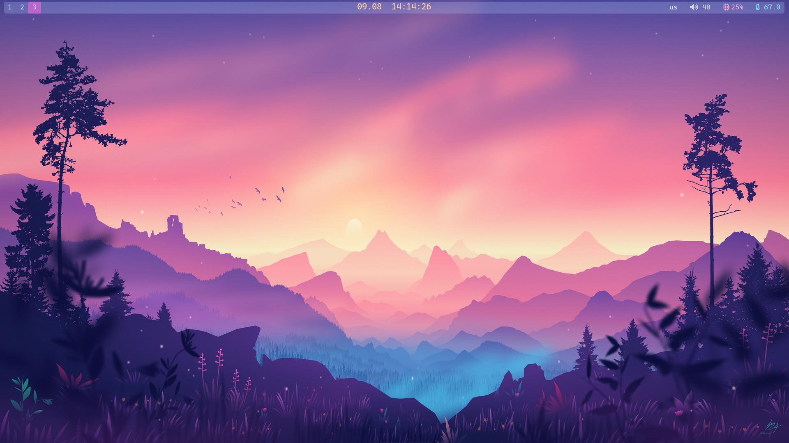

# Конфігурація Tiling Window Manager


<br>


## Компоненти

### Основні компоненти:
1. **bspwm** -> налаштування вікон
2. **sxhkd** -> налаштування комбінацій клавіш
3. **polybar** -> полоска зверху яка відображає певну інформацію
4. **picom** -> керування тінню, прозорістю, ...
5. **alacritty** -> простий термінал який добре підходить до тайлінгу
6. **rofi** -> дозволяє швидко находити та відкривати файли на пристрої

### Компоненти X-сервера:
1. **xorg-server** -> основний елемент X-сервера
2. **xorg-xinit** -> дозволяє власноруч запустити сесію
3. **xorg-xrandr** -> інструмент для керування роздільною здатністю дисплеїв

### Додаткові пакети:
1. **brightnessctl** -> керує яскравістю екрана
2. **playerctl** -> керує музикою
3. **xkb-switch** -> керує розкладкою клавіатури

## Встановлення конфігурації

**1. Встановлюємо пакети**
```sh
sudo pacman -S bspwm sxhkd polybar picom alacritty rofi \
                xorg-server xorg-xinit xorg-xrandr \
                brightnessctl playerctl
```

**2. Додаткові пакети із yay**
```sh
yay -S xkb-switch
```

**3. Встановлення шрифту (який підтримує іконки)**
```sh
sudo pacman -S ttf-cascadia-mono-nerd
```

**4. Клонуємо репозиторій**
```sh
git clone https://github.com/Ilya-MAO/TilingWM-config.git $HOME/.tiling-config/
cd $HOME/.tiling-config/
```

**5. Прописуємо команду для створення посилань у `~/.config`**
```sh
./setup.sh
```

**6. Створюємо файл `~/.xinitrc` та прописуємо там дві команди:**
```sh
sxhkd &
exec bspwm
```

**7. Запускаємо сесію у тайлінгу**
```sh
startx
```

## Додатково

#### Автоматичний вхід у сесію після авторизації
- Знайти файл оболонки, наприклад `~/.bashrc`
- Вкінці прописати команду:
```sh
if [[ -z $DISPLAY ]] && [[ $(tty) = /dev/tty1 ]]; then
   exec startx
fi
```
- Перезавантажте систему `reboot now`

#### Встановлення роздільної здатності через `xrandr`
```sh
xrandr # шукаємо назву дисплея
cvt 1920 1080 60 # генерація нової моделі, де 1920x1080 та частота 60

# знаходимо у попередній команді генерацію та прописуємо її в наступній:
xrandr --newmode "1920x1080_60.00" 173.00 1920 2048 2248 2576 1080 1083 1088 1120 -hsync +vsync # додавання цієї моделі в `xrandr`
xrandr --addmode eDP-1 "1920x1080_60.00" # прив'язка моделі до дисплея `eDP-1`
xrandr --output eDP-1 --mode "1920x1080_60.00" # оновлення моделі для дисплея `eDP-1`
```
